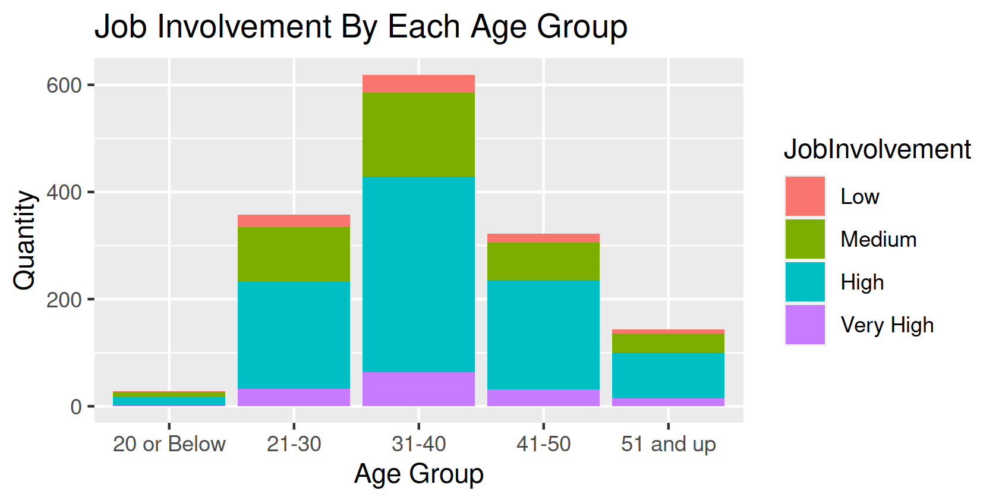

<br/>
<p align="center">
  <a href="https://github.com/jenkins96/ExploringAttritionDataset">
    
  </a>

  <h3 align="center">Exploratory Data Analysis - Attrition Dataset</h3>

  <p align="center">
    Every Project Teaches Us Something New!
    <br/>
    <br/>
    <a href="https://github.com/jenkins96/ExploringAttritionDataset"><strong>Explore the docs »</strong></a>
    <br/>
    <br/>
    <a href="https://github.com/jenkins96/ExploringAttritionDataset">View Demo</a>
    .
    <a href="https://github.com/jenkins96/ExploringAttritionDataset/issues">Report Bug</a>
    .
    <a href="https://github.com/jenkins96/ExploringAttritionDataset/issues">Request Feature</a>
  </p>
</p>


## Table Of Contents

* [About the Project](#about-the-project)
* [Built With](#built-with)
* [Getting Started](#getting-started)
  * [Prerequisites](#prerequisites)
  * [Installation](#installation)
* [Usage](#usage)
* [Authors](#authors)

## About The Project


Exploratory data analysis with R.  
Data set was obtained from [IBM HR Analytics Employee Attrition & Performance](https://www.kaggle.com/pavansubhasht/ibm-hr-analytics-attrition-dataset) 

## Built With

* R
* RStudio
* tidyverse (ggplot2, dplyr, tidyr, readr, purrr, tibble, stringr, forcats)
* skimr
* magrittr
* raster
* modeest
* moments
* [Table Generator](https://www.tablesgenerator.com) 

## Getting Started

This is an example of how you may give instructions on setting up your project locally.
To get a local copy up and running follow these simple example steps.

### Prerequisites
None if you just want to look at the output. Just download the whole directory and then open "EDA.html" file.
If you want to modify or experiment with the code you should have R base and hopefully RStudio installed.

### Installation

1. Clone the repo

```sh
git clone https://github.com/jenkins96/ExploringAttritionDataset.git
```

2. Open R project: "ExploringAttritionDataset.Rproj"


3. Install and load the required libraries
Script comes with function for installing and loading libraries if needed.


## Usage

Just explore the html file!



## Authors

* **Adrián Jenkins** - ** - [Adrian Jenkins](https://github.com/jenkins96) - **


